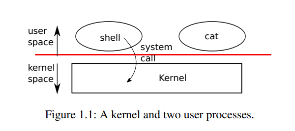
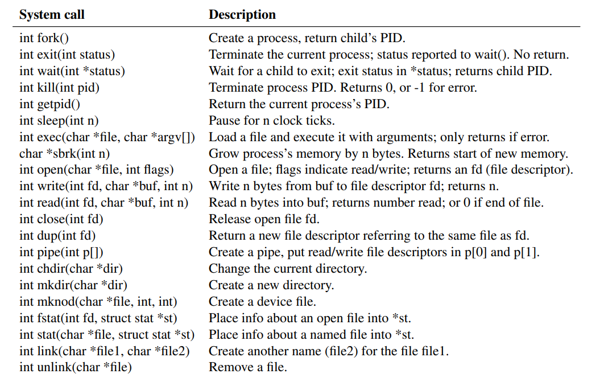

操作系统的作用主要有两个：一个是管理计算机资源分配给多个程序，另一个是在硬件支持的基础上，提供更多有用的服务。操作系统管理底层硬件，并把这些底层硬件抽象化，提供统一的接口给到上层应用，上层应用对底层硬件并无感知。据个例子：一个文字处理程序更本不关心它是用什么类型的磁盘来存储数据的。操作系统给多个程序分享硬件资源，让这些程序能够“同时运行”。最后，操作系统提供了某些控制机制，让这些程序得以相互交互，实现数据分享和合作分工。

操作系统通过接口给用户程序提供服务。接口设计这个活不简单，一方面我们希望接口尽可能的小而美，这样我们在实现的时候就很方便，不容易出错；但是另一方面我们又希望给到应用程序很多高级炫酷的特性，能够覆盖更多的需求。解决这个矛盾的关键是：组合。接口设计依赖于一些机制，这些机制可以相互组合，以此来提供更多的通用性。

本书使用一个单用户操作系统作为具体的例子来阐述操作系统的概念。这个单用户操作系统，即 `xv6`，提供了一些基本的接口，灵感来源于 `Ken Thompson` 和 `Dennis Ritchie` 所设计的 `Unix` 操作系统；并且本系统模仿了 `Unix` 的内部设计。`Unix` 接口设计非常简介，但是通过合理的组合，可以实现非常高的通用性。这个接口设计是如此成功以至于后来许多现代操作系统，比如：`BSD`、`Linux`、`macOS`、`Solaris`，甚至连微软都采用了类似的接口设计。理解和掌握 `xv6` 对以后学习这些现代操作系统非常有帮助。

如图 1.1 所示，`xv6` 采用了传统的内核模型。内核是一个为其他程序提供服务的特殊程序。每一个运行中的程序，被称为一个进程，它占用一部分内存，用来存储指令、数据和一个栈。指令用于完成程序的计算工作。数据就是计算过程中用到的变量。至于栈，它被用来组织程序调用流程。通常，一个系统上会有多个进程，但是只有一个内核。

当一个进程需要使用内核服务时，它会触发一次*系统调用*，即某个操作系统中定义的调用。这个调用过程会传递给内核，由内核来执行并返回。所以进程总是在*用户空间*和*内核空间*交替执行。

内核使用 `CPU` 提供的硬件保护机制来确保，每个运行在用户空间的进程仅能访问自己的内存资源，互相隔离。内核可以突破这一限制，执行一些高权限操作，而用户程序则没有这些权限。当用户程序执行一次系统调用时，硬件会提升权限，并且执行内核中预定义的功能。

内核所提供的所有系统调用，在用户程序看来就是系统接口。和传统的 `Unix` 内核所提供的服务和系统调用相比，`xv6` 系统内核只提供了其中的一部分。图 1.2 列出了所有 `xv6` 的系统调用。

接下来，本章将概述 `xv6` 所提供的服务，包括：进程、内存、文件描述符、管道以及文件系统。为了更好地理解它们，我们将展示一些代码片段，并且讨论*壳（`Shell`，`Unix` 的命令行用户接口）* 如何使用这些服务的。当你理解了 `Shell` 是如何进行系统调用后，你就会体会到这些接口设计是多么巧妙。

`Shell` 就是一个普通的程序，它接受用户输入的指令并且执行。事实上，`Shell` 作为一个不属于内核的用户程序，充分说明了系统调用接口的强大，就它本身而言并没有什么特殊。这也意味着 `Shell` 的版本很容易被替代。事实上，现代 Unix 系统有丰富的 `Shell` 可以使用，每种 `Shell` 都有自己的用户界面和脚本特性。而 `xv6` 所使用的 `Shell` 是 `Unix Bourne Shell` 的简单实现。它的实现代码在 user/sh.c:1 路径下。
# 1.1 进程和内存
一个 `xv6` 的进程由两部分构成，一部分是用户空间的内存（指令、数据和栈），另一部分是仅对内核可见的进程状态。`xv6` 系统分时处理进程：它在所有等待的进程中不断切换可用 `CPU` 资源。当一个进程不运行时，`xv6` 会保存它的 `CPU` 寄存器信息，然后在进程再次启动时恢复这些信息。内核会标记每个进程，这个标记信息叫做进程标识符（`PID`）。

一个进程可以通过调用 `fork` 系统调用函数来创建一个新的进程。`Fork` 函数会给新进程初始化内存信息（指令和数据），这些信息和调用进程的内存信息是一样的。`Fork` 函数在原始进程和新进程中都有返回值。在原始进程中，`fork` 函数返回新进程的 `PID` 信息。在新进程中，`fork` 函数的返回值是0。原始进程和新进程进程被称为*父进程*和*子进程*。

举例来说，让我们看一下如下用 C 语言写的代码片段：
```c
int pid = fork();

if (pid > 0) {
    printf("parent: child=%d\n", pid);
    pid = wait((int *) 0);
    printf("child %d is done\n", pid);
} else if (pid == 0) {
    printf("child: exiting\n");
    exit(0);
} else {
    printf("fork error\n");
}
```
调用 `exit` 函数会使得当前进程停止执行，并且释放资源（内存和被打开的文件）。`Exit` 函数接收一个整型参数，这个参数表示状态：0表示成功，1表示失败。`wait` 函数返回子进程（已退出或已死亡）的 `PID` 值，并且将子进程的退出状态拷贝到作为参数传入的内存地址上。如果当前进程没有子进程退出，那么 `wait` 函数会一直等待，直到有子进程退出。而如果当前进程没有子进程，那么 `wait` 函数直接返回-1。如果父进程不关心子进程的退出状态，那么直接给 `wait` 函数传为0作为地址参数。

在上面的例子中，下面的输出行
```
parent: child=1234
child: exiting
```
可能以任意的顺序输出，这取决于子进程或父进程哪个先调用 `printf` 函数。当子进程退出后i，父进程的 `wait` 函数也会返回，导致父进程会打印：
```
parent: child 1234 is done
```
尽管子进程在初始化时有和父进程一样的内容，但是夫进程和子进程在不同的内存空间和寄存器中执行：在一个进程中改变一个变量并不会影响另一个。比如，当 `wait` 函数的返回值在父进程中被存进 `pid` 变量后，子进程中的 `pid` 变量并不会被改变。子进程中的 `pid` 变量的值还是0。

`exit` 函数会加载文件系统中的某个文件内容到内存中，并且替换当前进程的内存信息。这个文件必须有一个特殊的格式，用来定义文件哪部分是指令、哪部分是数据、指令从那里开始等等。`Xv6` 系统使用 `ELF` 文件格式，这部分内容将在第三章详细讨论。当 `exec` 函数执行成功后，它并不会返回调用进程；相反，从文件中加载的指令会从 `ELF` 头文件中定义的入口开始运行。 `Exec` 函数接收两个参数：包含可执行代码文件的文件名，以及一个字符串数组。比如：
```c
char *args[3];

argv[0] = "echo";
argv[1] = "hello";
argv[2] = 0;
exec("/bin/echo", argv);
printf("exec error\n");
```
这段代码在执行到 `exec` 函数时，会进入 `/bin/echo` 这个程序执行，此程序的参数是 `echo hello`。大部分 `echo` 程序都会忽略参数列表的第一个参数，通常情况下第一个参数指代程序名称，这里是 `echo`。

`xv6 shell` 使用上述方式为用户运行程序。`shell` 程序的主结构很简单，可以看 `main` 方法（user/sh.c:145）。方法中有一个主循环，通过调用 `getcmd` 函数来读取用户输入。随后调用 `fork` 函数来拷贝 `shell` 进程。当子进程运行指令时，父进程调用 `wait` 函数处于等待状态。举例来说，如果用户向 `shell` 输入 `"echo hello"`，`runcmd` 函数将会被调用，`"echo hello"` 会作为参数传入。`runcmd(user/sh.c:58)` 函数开始执行。对于 `"echo hello"`，它会调用 `exec(user/sh.c:78)` 函数。如果 `exec` 函数调用成功，那么子进程将从 `runcmd` 函数跳出，开始执行 `echo` 函数。在某个时刻，`echo` 函数将调用 `exit` 函数，这会导致父进程从 `main(user/sh.c:145)` 方法中 `wait` 函数调用处返回。

你可能会奇怪为什么 `fork` 函数和 `exec` 函数没有合并成一个调用；我们后面会看到 `shell` 在实现 `I/O` 重定向时利用了这种分离设计。在上述用例中，子进程创建时进行了一次内存分配，在子进程中没有其他逻辑，它直接又调用了 `exec` 函数，又进行了一次内存分配。为了避免这种浪费，内核通过虚拟内存技术（比如 `copy_on_write`，详见第4章第6节）优化了这种情况下 `fork` 函数实现。

`Xv6` 系统通常隐式地为用户空间分配内存：在调用 `fork` 函数时，系统会自动为子进程分配拷贝父进程内容所需的内存空间，在调用 `exec` 函数时，系统会可执行文件分配足够的内存。一个进程如果在运行时需要更多的内存，那么可以通过调用 `sbrk(n)` 函数来增加 `n` 个字节的空间；`sbrk` 函数会返回新的内存地址。
# 1.2 I/O 和文件描述符
*文件描述符*是一个小的整数，代码了一个由内核管理的对象，并且进程可以对这个对象进行读写。一个进程可以通过打开一个文件、文件夹、设备，创建一个管道，或者复制一个存在的描述符的方式来获取一个文件描述符。为了简单起见，我们把文件描述符指向的对象称为一个文件；文件描述符接口通过抽象，隐藏了文件、管道和设备的不同，使它们看起来都像是字节流。我们把输入和输出称为 *I/O*。

xv6 系统内核会把文件描述符作为索引值放到每个进程的一张表中，以供进程访问，这张表从0开始计数。通常，进程从文件描述符0（标准输入）处读取数据，向文件描述符1（标准输出）处写入数据，向文件描述符2（标准错误）处写入错误。后面我们会看到，内核利用这个特性来实现 `I/O` 的重定向和管道。`shell` 会保证打开三个文件描述符（user/sh.c:151）作为控制台的文件描述符。

`read` 和 `write` 函数通过文件描述符来向打开的文件读写数据。`read(fd, buf, n)` 函数从文件描述符 `fd` 处最多读取 n 个字节，并把它们拷贝到 `buf` 里，返回已读取的字节数。每个指向文件的文件描述符都有一个偏移量值。`Read` 函数从当前的文件偏移量处开始读取，随后把偏移量值增加已读的字节数：后续的读取会从新的偏移量处开始读取。如果没有剩余的内容可以读取，`read` 函数会返回0代表读取文件结束。

`write(fd, buf, n)` 函数从 `buf` 处，向文件描述符 `fd` 处写入 n 个字节的数据，并且返回已写入的字节数。只有发生错误时才会导致写入数量小于 n 个字节。就像 `read` 函数一样，`write` 函数会从当前的文件偏移量处开始写入，随后把偏移量增加已写的字节数，后续的写入操作会从新的偏移量处写入。

下面俄程序片段（这是 `cat` 函数的关键）从标准输入向标准输出拷贝函数。如果有错误发生，它会向标准错误输出信息。
```c
char buf[512];
int n;

for(;;) {
    n = read(0, buf, sizeof buf);
    if (n == 0) {
        break;
    }
    if (n < 0) {
        fprintf(2, "read error\n");
        exit(1);
    }
    if (write(1, buf, n) != n) {
        fprintf(2, "write error\n");
        exit(1);
    }
}
```
关于上述代码片段，有一点要注意：真正的 `cat` 函数并不知道它的读取来源，可能是文件，可能时控制台，可能是管道。同样，`cat` 函数也不知道它的输出源，可能是控制台，可能是文件或其它。文件描述符的使用，以及把文件描述符0作为标准输入、把文件描述符1作为标准输出的传统，使得我们可以实现一个简单的 `cat` 函数。